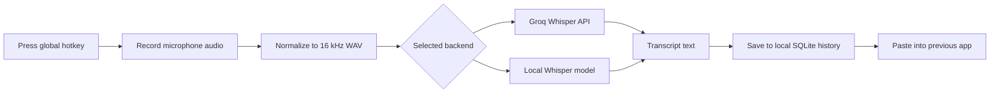

<div align="center">
  <h1>Svara</h1>
  <p><strong>A fast, privacy-first macOS voice-to-text tray app.</strong></p>
  <p>
    Press a global shortcut, speak naturally, and let Svara transcribe your voice into the app you were already using.
  </p>

  <p>
    
    
    
    
    
  </p>
</div>

---

## What Is Svara?

Svara is a desktop dictation assistant for macOS. It runs from the system tray, listens through a configurable global hotkey, transcribes microphone audio, and pastes the finished text into the application that had focus before recording began.

It is designed for people who want the speed of cloud transcription when they need it, plus an on-device path when privacy or offline work matters more.

## Highlights

- **Global dictation shortcut**: toggle recording from anywhere with the default `CmdOrCtrl+Shift+Space` shortcut.
- **Automatic text insertion**: Svara restores the previously focused app and simulates paste after transcription.
- **Two transcription modes**: use Groq Cloud with `whisper-large-v3-turbo` or compile with Local Whisper support.
- **Local transcript history**: the latest 100 non-empty transcripts are stored in a local SQLite database.
- **Microphone selection**: choose the system default input or a specific audio device.
- **Model downloader**: download `ggml-large-v3-turbo.bin` from the app when using local transcription.
- **Tray-first workflow**: open Settings, History, or Quit from the macOS menu bar.
- **Native permission helpers**: jump directly to macOS Microphone or Accessibility settings when permissions are missing.
- **Launch at login**: optional autostart support via a macOS Launch Agent.

## Product Flow



## Application Windows

| Surface | Purpose |
| --- | --- |
| **Home** | Record on demand, review recent transcripts, see usage stats, copy or delete transcript entries. |
| **Settings** | Choose transcription backend, save a Groq API key, download the local model, configure hotkey, select microphone, and enable launch at login. |
| **History** | Dedicated transcript history window with refresh, copy, delete, and clear-all actions. |
| **Status Overlay** | Small floating indicator for recording, transcribing, and insertion states. |
| **Tray Menu** | Open Settings, open History, or quit Svara from the macOS menu bar. |

## Tech Stack

| Layer | Technology |
| --- | --- |
| Desktop runtime | Tauri 2 |
| Native backend | Rust |
| Frontend | React 18, TypeScript, Vite |
| Styling | Tailwind CSS, Lucide icons |
| State | Zustand |
| Audio capture | `cpal`, `hound` |
| Cloud transcription | Groq OpenAI-compatible audio transcription API |
| Local transcription | `whisper-rs` behind the `local-whisper` feature |
| Storage | SQLite via `rusqlite` |
| Text insertion | macOS Accessibility APIs plus clipboard paste |

## Install Svara

**Current version:** `v0.1.0`

The easiest way to use Svara is to install the macOS DMG. No cloning, no terminal setup, no developer tooling.

1. Download the latest `.dmg` from [Svara DMG](https://github.com/virat-mankali/svara/releases).
2. Open the DMG.
3. Drag **Svara** into your Applications folder.
4. Launch Svara and grant the macOS permissions it asks for.

For a fully local workflow, choose **Local Whisper** in Settings and download the model from inside the app. In local mode, your audio transcription runs on your Mac and your transcript history stays on your Mac.

Groq Cloud is also available if you prefer cloud transcription speed. That mode requires a Groq API key and sends recorded audio to Groq for processing.

## Developer Setup

If you want to inspect the code, customize the app, or contribute changes, run Svara from source.

### Requirements

- macOS
- Node.js 18 or newer
- Rust 1.77.2 or newer
- Tauri CLI 2.x
- CMake for Local Whisper builds

Install the native build tools:

```bash
brew install cmake
cargo install tauri-cli --version "^2"
```

Clone and run the app:

```bash
git clone https://github.com/virat-mankali/svara.git
cd svara
npm install
npm run tauri -- dev
```

The `npm run tauri` wrapper automatically enables the `local-whisper` Rust feature for `dev` and `build`, so the full local backend is compiled when the required native tooling is present.

Create a production desktop bundle:

```bash
npm run tauri -- build
```

If you want to call Tauri directly, enable the local Whisper feature yourself:

```bash
cargo tauri build --features local-whisper
```

The app bundle is generated by Tauri under `src-tauri/target/release/bundle`.

## Using Svara

1. Launch Svara.
2. Grant **Microphone** permission when macOS asks.
3. Grant **Accessibility** permission so Svara can paste text into other apps.
4. Open Settings from the tray or startup window.
5. Choose a transcription backend:
   - **Groq Cloud**: save your Groq API key, then record.
   - **Local Whisper**: download the local model, then switch to Local Whisper.
6. Press `CmdOrCtrl+Shift+Space`, speak, then press the shortcut again to stop.
7. Svara transcribes the audio, saves the result, and inserts it into the previously active app.

## Privacy Model

Svara is built around local-first desktop behavior:

- Transcript history is stored locally in SQLite.
- The app keeps only the latest 100 transcript entries.
- Local Whisper transcription runs on-device when the app is built with the `local-whisper` feature.
- Groq Cloud transcription sends recorded audio to Groq for processing.
- The Groq API key is stored locally in Svara's app configuration. Do not commit real keys to `.env`, screenshots, or shared config files.
- No analytics or telemetry service is wired into this codebase.

On macOS, Svara stores its app data in the platform data directory, typically:

```text
~/Library/Application Support/svara
```

## Configuration

Svara persists these settings in `config.json`:

| Setting | Description | Default |
| --- | --- | --- |
| `backend` | Transcription backend: `groq` or `local`. | `groq` |
| `hotkey` | Global shortcut recognized by Tauri. | `CmdOrCtrl+Shift+Space` |
| `audio_device` | Optional named input device. | `null` |
| `local_model_path` | Path to the local Whisper model. | Platform data directory |
| `groq_api_key` | Optional Groq API key. | `null` |
| `autostart` | Launch Svara at login. | `false` |

## Project Structure

```text
svara/
|-- src/                         # React + TypeScript frontend
|   |-- windows/                 # Settings, History, Status surfaces
|   |-- components/              # Reusable controls and transcript rows
|   |-- hooks/                   # Tauri event listeners
|   |-- lib/                     # Typed Tauri command wrappers
|   `-- store/                   # Zustand app state
|-- src-tauri/                   # Rust desktop backend
|   |-- src/
|   |   |-- audio.rs             # Microphone capture and WAV encoding
|   |   |-- commands.rs          # Tauri IPC commands
|   |   |-- config.rs            # App settings persistence
|   |   |-- history.rs           # SQLite transcript history
|   |   |-- inject.rs            # macOS text insertion
|   |   `-- transcribe/          # Groq and Local Whisper backends
|   |-- tauri.conf.json          # Tauri windows, bundle, and build config
|   `-- Cargo.toml               # Rust dependencies and features
|-- scripts/tauri.mjs            # Tauri CLI wrapper with local feature support
|-- package.json                 # Frontend scripts and dependencies
`-- README.md
```

## Architecture Notes

- `src-tauri/src/lib.rs` initializes Tauri plugins, registers the tray menu, attaches the global hotkey, opens the settings window, and wires all IPC commands.
- `src-tauri/src/audio.rs` runs microphone capture on a dedicated thread, downmixes to mono, resamples to 16 kHz, normalizes gain, and writes a temporary WAV file.
- `src-tauri/src/transcribe/groq.rs` posts the WAV file to Groq's OpenAI-compatible transcription endpoint.
- `src-tauri/src/transcribe/local.rs` uses `whisper-rs` when compiled with `local-whisper`; otherwise it returns a clear runtime error.
- `src-tauri/src/inject.rs` captures the frontmost macOS process before recording, restores focus, writes to the clipboard, sends `Cmd+V`, then attempts to restore the previous clipboard text.
- `src/windows/Settings.tsx` is the main app workspace, including the home transcript timeline and settings page.

## Permissions

Svara needs two macOS permissions for the complete workflow:

| Permission | Why it is needed |
| --- | --- |
| Microphone | Capture your voice for transcription. |
| Accessibility | Paste generated text into other apps through keyboard automation. |

If either permission is missing, Svara surfaces an error with a button that opens the correct macOS System Settings pane.

## Development Scripts

| Command | Description |
| --- | --- |
| `npm run dev` | Start the Vite frontend only. |
| `npm run build` | Type-check and build the frontend. |
| `npm run preview` | Preview the built frontend. |
| `npm run tauri -- dev` | Run the full desktop app in development mode. |
| `npm run tauri -- build` | Build the production desktop app. |

## Roadmap Ideas

- Secure key storage through macOS Keychain.
- Signed and notarized macOS releases.
- Custom local model selection in the UI.
- Multi-language transcription controls.
- Transcript search and export.
- Push-to-talk mode in addition to toggle recording.

## License

Svara is released under the MIT License.
