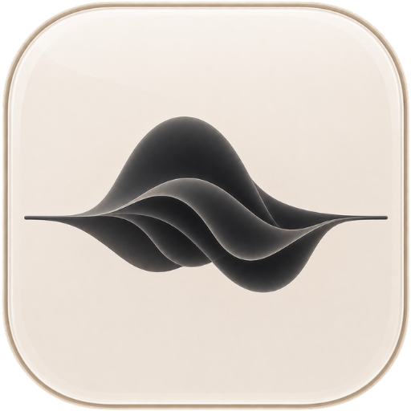

<table>
  <tr>
    <td>
      <h1>Svara</h1>
      <p><strong>Speak. Paste. Done.</strong></p>
      <p><sub>~ Built with ❤️ by Virat Mankali 🍻</sub></p>
      <p>
        A fast, privacy-first macOS voice-to-text tray app that turns your voice into clean text anywhere you type.
      </p>
      <p>
        Press a shortcut, say what you want, and Svara drops the transcript into the app you were already using.
      </p>
    </td>
    <td width="180" align="right">
      
    </td>
  </tr>
</table>

<p align="center">
  
  
  
  
  
</p>

---

## What Is Svara?

Svara is a tiny dictation layer for your Mac. It sits in the menu bar, listens when you press a hotkey, transcribes your voice, and pastes the result exactly where you were working.

Use Groq when you want speed. Use Local Whisper when you want everything on-device. Either way, Svara keeps the workflow simple: talk once, get text instantly.

## At a Glance

| Svara gives you | Why it matters |
| --- | --- |
| 🎙️ **One global shortcut** | Dictate from any app without breaking focus. |
| ⚡ **Fast transcription** | Use Groq Cloud when speed is the priority. |
| 🔒 **Local mode** | Use Local Whisper when you want transcription on-device. |
| 📝 **Clean history** | Keep your latest transcripts close, easy to copy, and local. |

## Highlights

Svara is built for one tiny loop:

```text
Press shortcut -> speak naturally -> Svara transcribes -> text appears where you were typing
```

- Works from the macOS menu bar.
- Pastes back into the app you were already using.
- Stores the latest 100 transcripts locally.
- Lets you pick a microphone, custom hotkey, and launch-at-login behavior.
- Helps you open the right macOS permission screens when setup needs attention.

## Install Svara

**Current version:** `v1.1.0`

The easiest way to use Svara is the macOS DMG. No cloning, no terminal setup, no developer tooling.

1. Download the latest `.dmg` from [Svara DMG](https://github.com/virat-mankali/svara/releases).
2. Open the DMG.
3. Drag **Svara** into your Applications folder.
4. Launch Svara and grant the macOS permissions it asks for.

That is it. You now have a menu-bar voice assistant for your Mac.

## How To Use

1. Open Svara.
2. Choose **Groq Cloud** or **Local Whisper** in Settings.
3. Press `CmdOrCtrl+Shift+Space`.
4. Speak, press the shortcut again, and watch the text appear.

Use **Groq Cloud** for quick setup and fast transcription. Use **Local Whisper** for the most private workflow, with the model downloaded from inside Svara.

## Privacy

Svara is local-first:

- Transcript history is stored on your Mac in SQLite.
- Local Whisper runs transcription on-device.
- Groq Cloud sends recorded audio to Groq for transcription.
- No analytics or telemetry service is wired into the app.

App data usually lives here:

```text
~/Library/Application Support/svara
```

## Developer Setup

Want to inspect, customize, or contribute?

**Requirements:** macOS, Node.js 18+, Rust 1.77.2+, Tauri CLI 2.x, and CMake for Local Whisper builds.

```bash
git clone https://github.com/virat-mankali/svara.git
cd svara
npm install
npm run tauri -- dev
npm run tauri -- build
```

The `npm run tauri` wrapper enables the `local-whisper` Rust feature for dev and build, so the local backend is included when native tooling is available.

## Tech Stack

Tauri 2, Rust, React 18, TypeScript, Vite, Tailwind CSS, Zustand, SQLite, Groq Whisper, and `whisper-rs`.

## License

Svara is released under the MIT License.
